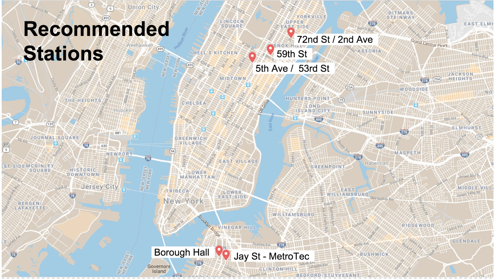
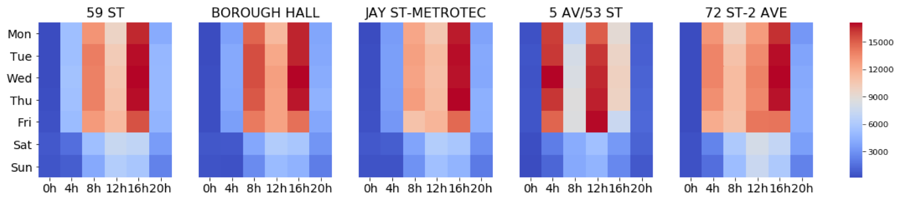

# Project 1: MTA Turnstile Data

## Background
Week 1 of the Metis Data Science Bootcamp is in the books! Our first project was a group one, in which we were tasked with mining NYC MTA Turnstile data to recommend optimal deployment of a Tech organization's volunteers. The organization wished to acquire mailing list sign-ups, promote their upcoming gala, and solicit potential donors. We were free to use other datasets.

### Team Members

I need to start off by recognizing my team: Brenner Heintz, Hiranya Kumar, and Luke Tibbott. Our collective ideas, feedback, and efforts made a better final product than I would have been able to produce on my own. It was a pleasure to work with them.

### Data
- [MTA Turnstile Data](http://web.mta.info/developers/turnstile.html)
- Census data

### Tools:
- Python, Pandas, Matplotlib, Seaborn
- Google API


### Approach
Select top stations based on:
- Traffic volume: a high-volume station means interacting with more people
- Commuter "fingerprint": tourists are less likely to attend the Gala (and donate) than native New Yorkers.
- Proximity to high-income residents: people with more disposable income are more likely to donate. 

## Data Cleaning

### MTA Data

We started off by downloading one dataset from the MTA website and importing it into python using a csv reader. A scan of the dataframe revealed an issue with the naming of the 'EXITS' column (it contained extra whitespace -- easily removed with `str.strip()`. This may seem like a small detail, but I mention it because **review of imported data is an essential part of data munging**. 

The entry and exit data are given as a series of counter values every 4 hours, *usually* (but not always...see below) at 0:00, 4:00, 8:00, etc. Thus, to get the actual number of entries and exits, we needed to calculate the difference between consecutive rows for a given station's turnstile:

    df['ENTRY_DIFFS'] = df.groupby(['STATION_KEY','TURNSTILE'])['ENTRIES'].diff(periods=-1)*-1

**Anytime you apply a function** to a dataframe, it's a good idea to **check that it performed as intended**. Reviewing the basic stats of the resulting 'ENTRY_DIFFS' column (or examining a distribution of the values) revealed some very large and some negative values. Examining the large-magnitude differences revealed that they appeared to be due to a resetting of the counter:


```python
rand_idx = df.loc[(df['ENTRY_DIFFS'] > 2E5)][:1].index[0]
df.loc[rand_idx-2:rand_idx+2, ['STATION_KEY', 'DATETIME','ENTRIES','ENTRY_DIFFS']]
```


<div>
<style scoped>
    .dataframe tbody tr th:only-of-type {
        vertical-align: middle;
    }

    .dataframe tbody tr th {
        vertical-align: top;
    }

    .dataframe thead th {
        text-align: right;
    }
</style>
<table border="1" class="dataframe">
  <thead>
    <tr style="text-align: right;">
      <th></th>
      <th>STATION_KEY</th>
      <th>DATETIME</th>
      <th>ENTRIES</th>
      <th>ENTRY_DIFFS</th>
    </tr>
  </thead>
  <tbody>
    <tr>
      <th>15399</th>
      <td>B020 R263 AVENUE H</td>
      <td>2018-05-23 04:00:00</td>
      <td>92835</td>
      <td>9.0</td>
    </tr>
    <tr>
      <th>15400</th>
      <td>B020 R263 AVENUE H</td>
      <td>2018-05-23 08:00:00</td>
      <td>92844</td>
      <td>18.0</td>
    </tr>
    <tr>
      <th>15401</th>
      <td>B020 R263 AVENUE H</td>
      <td>2018-05-23 12:00:00</td>
      <td>92862</td>
      <td>523768.0</td>
    </tr>
    <tr>
      <th>15402</th>
      <td>B020 R263 AVENUE H</td>
      <td>2018-05-23 16:00:00</td>
      <td>616630</td>
      <td>8.0</td>
    </tr>
    <tr>
      <th>15403</th>
      <td>B020 R263 AVENUE H</td>
      <td>2018-05-23 20:00:00</td>
      <td>616638</td>
      <td>1.0</td>
    </tr>
  </tbody>
</table>
</div>


We chose to filter these outliers out of our dataset. One of our instructors later mentioned that some turnstile's counters appeared to be counting down instead of up -- so one could simply invert their negative numbers and obtain reasonable data. **There are always choices like this to be made in cleaning data.**

### Census data

We downloaded income tax data from the U.S. 2016 Census and counted the number "high income" residents by zip code. We defined "high income" as earning >$100,000 per year.

### Addresses for stations

We used the GoogleMaps API to get the geocodes of (most) subways stations. We extracted the zip code from the address and merged it with the high-income residents dataframe.

## Results

We explored different ways of grouping, slicing, and performing statistical analyses on the MTA turnstile data. We ultimately calculated the **daily total median volume** (entries + exits) for each station and used this to score stations for traffic. We chose median, rather than mean or total volume, as we felt this would provide an additional protection against outliers in the data skewing our results. 

We explored a variety of ways to classify or score stations as commuter vs. tourist. We ultimately chose a **weekday:weekend ratio**, calculated using the total daily median for each station. We had to filter out stations that had anomalously low weekend traffic, likely due to station closings for track work. 

We examined the distribution of the number of high income residents to establish a cut-off value.

### Traffic + Income + Commuters

Plotting the number of high-income residents proximal to a station vs. median daily traffic at that station, and applying cut-off criteria:
- Traffic: total daily median volume > 50,000
- Income: number of high-income residents in the same zipcode as the station > 8,000
- Commuters: high weekday:weekend median daily traffic ratio > 2.0


We arrived at 5 stations that meet these criteria.

## Conclusions

We recommended the organization target these 5 subways stations in their soliciation efforts:



We could further recommend the time of day to visit these staions. The heatmaps below show total meidan traffic by time of day and day of week.



The best time of day to visit stations is Tues-Thurs during the evening rush hour (16h-20h). 

The 5 AV/53 ST station's heatmap appears different because its time data is shifted. This is an artifact of how the data were resampled. Most station data were reported in 4-hour time blocks starting at midnight (0h). However, not every station's data were reported in exact 4-hour increments, or at the same times (e.g. started at 2AM). We clearly did not do a good enough job of checking this data manipulation! It could be remedied by unsampling the data into 1-hour time blocks, then re-sampling into 4-hour blocks. 
